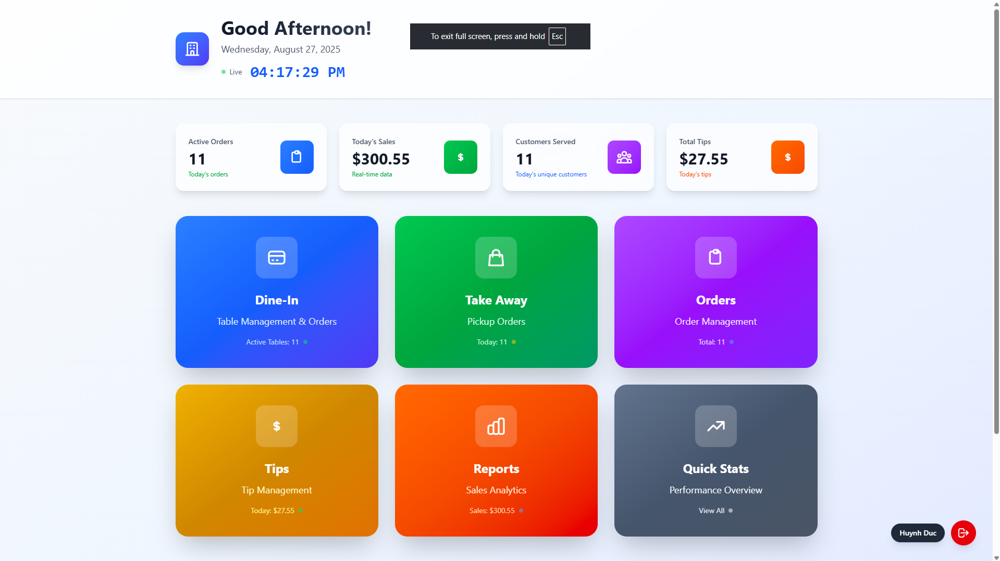
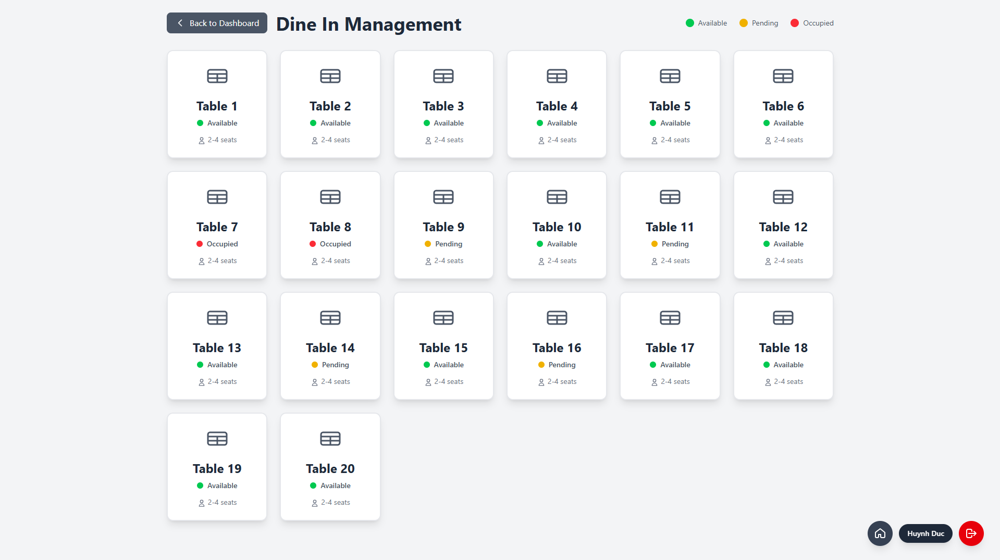
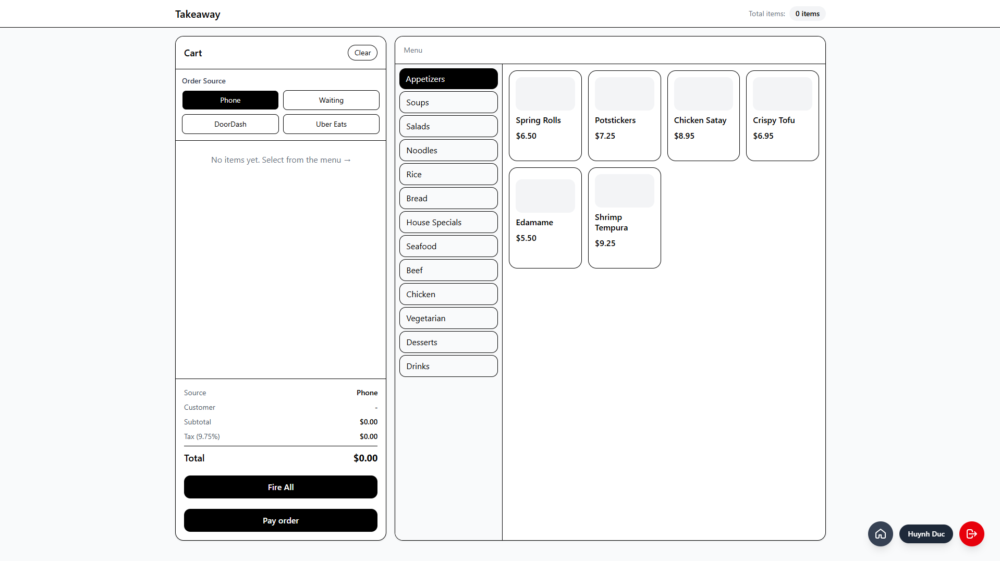
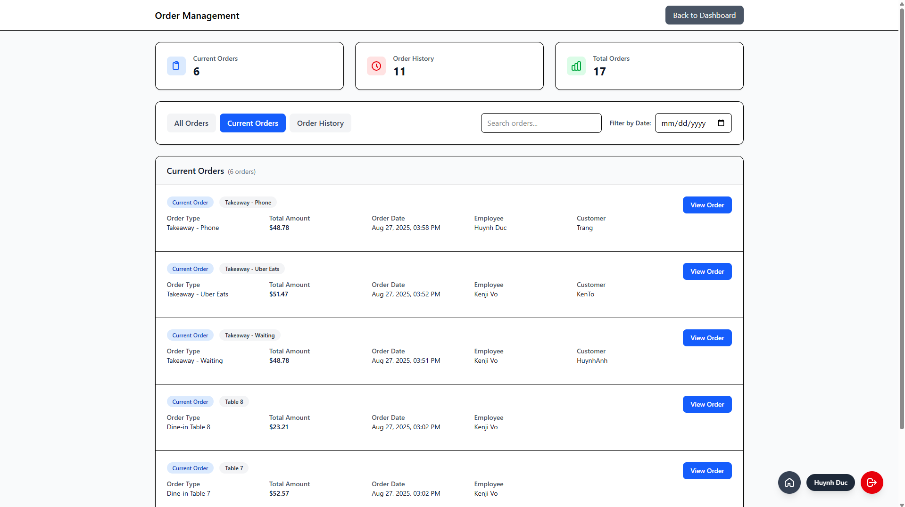
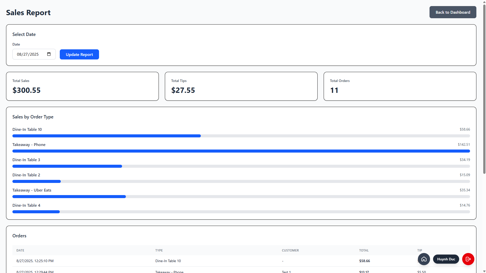
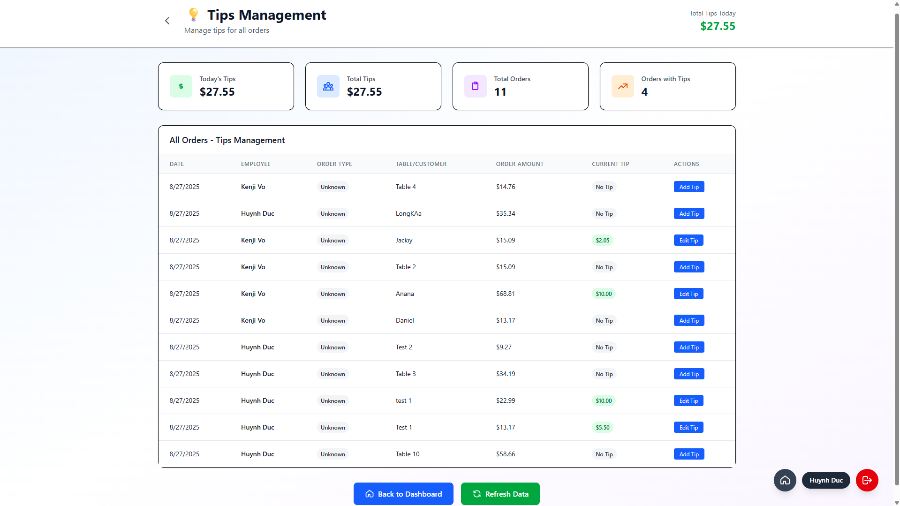
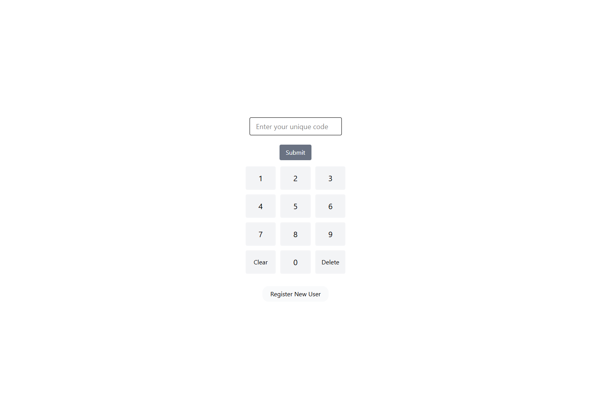

# 🍽️ Restaurant Management System

A comprehensive, modern restaurant management solution built with React, Tailwind, Express.js, and MongoDB. Manage dine-in orders, takeaway services, customer data, and business analytics all in one powerful dashboard.

## ✨ Features

### 🎯 **Core Management**
- **Dine-In Management**: Table assignments, order tracking, and customer service
- **Takeaway Orders**: Pickup order management with customer details
- **Order Processing**: Complete order lifecycle from creation to payment
- **Customer Database**: Store and manage customer information
- **Payment Processing**: Secure payment handling with tip management

### 📊 **Business Intelligence**
- **Real-Time Dashboard**: Live statistics and business metrics
- **Sales Analytics**: Daily, weekly, and monthly sales reports
- **Customer Insights**: Track customer preferences and order history
- **Performance Metrics**: Monitor staff performance and table turnover
- **Financial Reports**: Comprehensive revenue and tip analysis

### 🚀 **Technical Features**
- **Modern UI/UX**: Beautiful, responsive design with smooth animations
- **Real-Time Updates**: Live data synchronization across all modules
- **Cross-Platform**: Works seamlessly on desktop, tablet, and mobile
- **Secure Authentication**: User login and role-based access control
- **Data Persistence**: MongoDB database with reliable data storage

## 🖼️ Feature Screenshots

> **📸 Add your screenshots here to showcase the beautiful interface!**

### **Dashboard Overview**

*Real-time business metrics and live order statistics*

### **Dine-In Management**

*Table management and customer order creation*

### **Takeaway Orders**

*Pickup order management with customer details*

### **Order Management**

*Complete order lifecycle management*

### **Business Reports**

*Comprehensive sales analytics and insights*

### **Tips Management**

*Tip tracking and management system*

### **User Authentication**

*Secure user login and registration*

## 🛠️ Tech Stack

### **Frontend**
- **React 18** - Modern UI framework with hooks
- **Vite** - Fast build tool and development server
- **Tailwind CSS** - Utility-first CSS framework
- **React Router** - Client-side routing

### **Backend**
- **Node.js** - Server-side JavaScript runtime
- **Express.js** - Web application framework
- **MongoDB** - NoSQL database
- **Mongoose** - MongoDB object modeling

### **Development Tools**
- **ESLint** - Code quality and consistency
- **Git** - Version control
- **npm** - Package management

## 🚀 Quick Start

### **Prerequisites**
- Node.js (v16 or higher)
- MongoDB (local or cloud instance)
- npm or yarn package manager

### **1. Clone the Repository**
```bash
git clone <your-repository-url>
cd my-restaurant
```

### **2. Install Dependencies**
```bash
# Install frontend dependencies
npm install

# Install backend dependencies
cd server
npm install
cd ..
```

### **3. Environment Setup**
Create a `.env` file in the server directory:
```env
MONGODB_URI=mongodb://localhost:27017/restaurant
PORT=5000
JWT_SECRET=your-secret-key
```

### **4. Start the Application**
```bash
# Terminal 1: Start backend server
cd server
npm start

# Terminal 2: Start frontend development server
npm run dev
```

### **5. Access the Application**
- **Frontend**: http://localhost:5173
- **Backend API**: http://localhost:5000

## 📁 Project Structure

```
my-restaurant/
├── src/                      # Frontend source code
│   ├── pages/               # Application pages
│   │   ├── dashboard.jsx    # Main dashboard
│   │   ├── dinein.jsx       # Dine-in management
│   │   ├── getOrder.jsx     # Dine-in orders
│   │   ├── takeaway.jsx     # Takeaway orders
│   │   ├── order.jsx        # Order management
│   │   ├── login.jsx        # User authentication
│   │   ├── register.jsx     # User registration
│   │   ├── report.jsx       # Business reports
│   │   └── tips.jsx         # Tips management
│   ├── assets/              # Static assets
│   └── App.jsx              # Main application component
├── server/                   # Backend server
│   ├── models/              # Database models
│   │   ├── Orders.js        # Order data model
│   │   ├── Users.js         # User data model
│   │   ├── OrderHistory.js  # Order history data model
│   │   └── DineInTable.js   # Table management
│   ├── router/              # API routes
│   │   ├── login.js         # Login routes
│   │   ├── register.js      # Register routes
│   │   ├── payOrder.js      # Payment routes
│   │   ├── dineOrder.js     # Dine-in order routes
│   │   ├── takeawayOrder.js # Takeaway order routes
│   │   ├── orderHistory.js  # Order history routes
│   │   └── report.js        # Report routes
│   └── index.js             # Server entry point
├── public/                   # Public assets
└── package.json              # Project dependencies
```

## 🔧 Configuration

### **Database Models**
- **Orders**: Complete order information with items, totals, and payment details
- **Users**: Staff accounts with authentication and role management
- **DineInTable**: Table status and customer assignments
- **OrderHistory**: Historical order data for analytics

### **API Endpoints**
- `POST /api/login` - User authentication
- `POST /api/register` - User registration
- `POST /api/pay-order` - Process order payments
- `POST /api/dine-order` - Create dine-in orders
- `POST /api/takeaway-order` - Create takeaway orders
- `GET /api/order-history` - Retrieve order history
- `GET /api/report` - Generate business reports

## 📱 Key Pages

### **Dashboard** (`/dashboard`)
- Real-time business metrics
- Live order statistics
- Quick access to all modules
- Beautiful, animated interface

### **Dine-In** (`/dine-in`)
- Table management and assignment
- Customer order creation
- Real-time order tracking
- Payment processing

### **Get Orders** (`/get-order`)
- View and manage dine-in orders
- Order status updates
- Customer information display
- Table assignments

### **Takeaway** (`/takeaway`)
- Pickup order management
- Customer information capture
- Order preparation tracking
- Payment collection

### **Orders** (`/order`)
- Complete order management
- Order status updates
- Customer communication
- Order history review

### **Reports** (`/report`)
- Sales analytics and trends
- Customer behavior insights
- Financial performance metrics
- Business intelligence dashboards

### **Tips** (`/tips`)
- Tip collection and management
- Tip distribution tracking
- Staff tip reporting
- Tip analytics

### **Authentication** (`/login`, `/register`)
- Secure user login
- User registration
- Role-based access control
- Session management

## 🎨 UI/UX Features

- **Responsive Design**: Works perfectly on all device sizes
- **Dark/Light Themes**: Customizable interface appearance
- **Smooth Animations**: Engaging user interactions
- **Intuitive Navigation**: Easy-to-use interface
- **Real-Time Updates**: Live data synchronization
- **Loading States**: Beautiful loading animations
- **Error Handling**: User-friendly error messages

## 🔒 Security Features

- **JWT Authentication**: Secure user sessions
- **Role-Based Access**: Different permissions for different user types
- **Input Validation**: Server-side data validation
- **Secure Routes**: Protected API endpoints
- **Password Hashing**: Encrypted password storage

## 📊 Business Benefits

- **Increased Efficiency**: Streamlined order management
- **Better Customer Service**: Faster order processing
- **Data-Driven Decisions**: Comprehensive business analytics
- **Cost Reduction**: Automated processes and better tracking
- **Improved Accuracy**: Reduced manual errors
- **Enhanced Reporting**: Better business insights

## 🚀 Deployment

### **Frontend Deployment**
```bash
npm run build
# Deploy the dist/ folder to your hosting service
```

### **Backend Deployment**
```bash
# Set production environment variables
NODE_ENV=production
# Deploy to your preferred hosting service
```

## 🤝 Contributing

1. Fork the repository
2. Create a feature branch (`git checkout -b feature/amazing-feature`)
3. Commit your changes (`git commit -m 'Add amazing feature'`)
4. Push to the branch (`git push origin feature/amazing-feature`)
5. Open a Pull Request

## 📝 License

This project is licensed under the MIT License - see the [LICENSE](LICENSE) file for details.

## 📞 Support

For support and questions:
- **Email**: [your-email@example.com]
- **Issues**: [GitHub Issues](https://github.com/yourusername/my-restaurant/issues)
- **Documentation**: [Project Wiki](https://github.com/yourusername/my-restaurant/wiki)

## 🙏 Acknowledgments

- Built with ❤️ for restaurant owners and staff
- Inspired by the need for better restaurant management tools
- Special thanks to the open-source community

---

**Made with ❤️ for the restaurant industry**

*Transform your restaurant operations with this powerful management system!*
